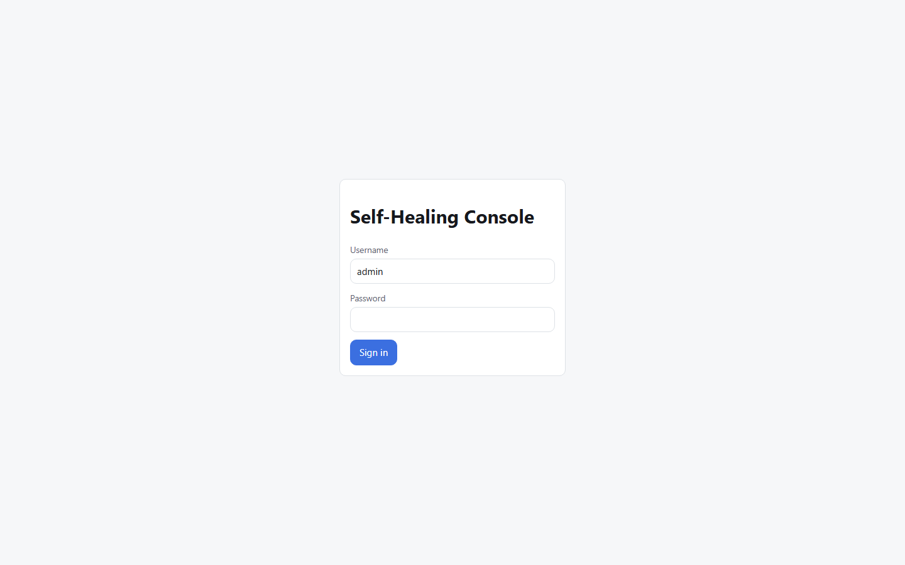
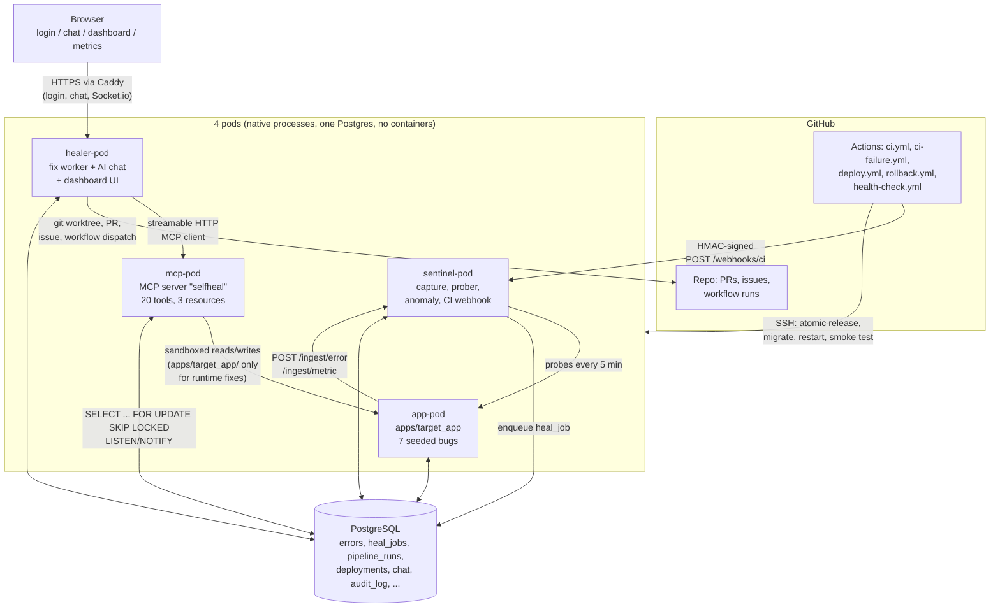

# AI-Powered Self-Healing Application

A self-healing application with an MCP server: it detects runtime errors,
silent wrong-output bugs and CI/CD failures, root-causes them with Claude
through an MCP server, generates a fix plus a regression test, ships it
through CI/CD, and verifies it — with a real-time AI chat UI and a metrics
dashboard proving MTTR, success rate and cost per fix.

All 8 build phases in `SPEC.md`'s BUILD ORDER are complete. See `CLAUDE.md`
for the full phase-by-phase build log, every ambiguity resolved along the
way, and conventions for resuming work.

## Screenshots



The healer-pod login page (`http://localhost:8000/`), captured headless via
Playwright against a real locally-running pod. The dashboard, AI chat, and
metrics pages are gated behind this login and aren't shown here — this
repo's `ADMIN_PASSWORD_HASH` is a one-way argon2 hash with no recorded
plaintext, and capturing those pages would have meant setting a new
password or otherwise weakening auth just for a screenshot, which this
project's own guardrails (see CLAUDE.md) explicitly refuse to do.

Real proof this system works end to end, from the AI itself, not staged
screenshots:

- [**PR #10**](https://github.com/Deepak20466/ai-self-healing-app/pull/10) —
  a real runtime bug (a silent timezone contract violation) diagnosed and
  fixed by the healer running in free mode (local Claude Code CLI, no
  Anthropic API key), with a regression test proving it failed before and
  passed after.
- [**PR #14**](https://github.com/Deepak20466/ai-self-healing-app/pull/14) —
  a real broken CI run, classified as a genuine failure (not flaky) and
  fixed forward on the PR's own branch by the healer's CI-fix agent, with
  CI going green automatically on the fix commit.

## Architecture

Four native processes ("pods" — no Docker, no Kubernetes, per SPEC.md's hard
constraints), one shared PostgreSQL database, and GitHub for CI/CD and PRs:



**Why this shape.** `apps/target_app` is the only thing being monitored, so
it's the only pod that can be broken by a bad fix — `mcp-pod` enforces in
code (not just in a prompt) that a `runtime_error`/`contract_violation` heal
job may only write inside `apps/target_app/`, so the healer can never break
itself. `sentinel-pod` and `mcp-pod` never talk to each other directly;
`healer-pod` is the only pod holding an MCP client, so it's the single place
that turns "detected" into "fixed, verified, deployed."

## Setup

```powershell
python -m venv .venv
.venv\Scripts\pip install -e ".[dev]"
copy .env.example .env
# Edit .env, then create the app + test databases and grant the app role
# CREATEDB (see CLAUDE.md "Environment on this machine" for why this can't
# be automated further):
.\scripts\bootstrap.ps1 -SuperuserPassword <your-postgres-superuser-password>
.venv\Scripts\alembic upgrade head
python scripts/hash_password.py            # generates ADMIN_PASSWORD_HASH
```

Set `ADMIN_PASSWORD_HASH` (from the command above) and `SESSION_SECRET` in
`.env` before starting healer-pod — the chat/dashboard/metrics UI is
unauthenticated-401 without them.

## AI backend: pluggable (Claude Code / Codex / Gemini CLIs, or the Anthropic API)

The healer (`healer/`) drives every automated fix (and the AI chat) through
one of **four** interchangeable backends, selected by `AI_BACKEND` in `.env`:

| `AI_BACKEND` | Module | Auth | Status |
|---|---|---|---|
| `claude_cli` (default) | `healer/agent_free.py` | local Claude Code CLI, your Claude subscription login | **live-verified** (real PRs — see below) |
| `codex_cli` | `healer/agent_codex.py` | local OpenAI Codex CLI, your ChatGPT/API login | **documented-only, untested live** — see caveat below |
| `gemini_cli` | `healer/agent_gemini.py` | local Google Gemini CLI, your Google account login | **documented-only, untested live** — see caveat below |
| `api` | `healer/runtime_agent.py` + `healer/ci_agent.py` | `ANTHROPIC_API_KEY`, official `anthropic` SDK | tested (mocked), no real end-to-end PR yet — see CLAUDE.md Phase 4 |

The old `USE_CLAUDE_CODE` boolean still works as a backwards-compatible
alias (`true` → `ai_backend=claude_cli`, `false` → `ai_backend=api`) — see
`core/config.py`'s `_derive_ai_backend_from_legacy_flag` for exactly how the
two settings interact if both are present. New setups should set
`AI_BACKEND` directly.

- **`claude_cli` (default, recommended).** Uses the local Claude Code CLI on
  your own Claude subscription login — no API key, no per-token billing.
  One-time setup: run `claude` once in this repo and log in interactively.
  After that, `python -m healer.worker` (or the combined `healer.app` pod,
  which runs the worker loop in-process — see below) just works.
- **`codex_cli` / `gemini_cli`.** Same idea for OpenAI's `codex` and
  Google's `gemini` CLIs, respectively — one-time interactive login, then
  the worker drives them non-interactively. **Neither CLI was installed on
  the machine these backends were built on** (`codex --help`/`gemini --help`
  both fail with "command not found" — checked directly), so
  `healer/agent_codex.py`/`healer/agent_gemini.py` are built from each
  project's public documentation, not a live `--help` dump, and have never
  been run against a real install. Each module's own docstring spells out
  exactly what's assumed vs. verified, including a real, documented gap for
  Codex CLI specifically: it has no per-invocation equivalent of Claude
  Code's `--allowedTools`/`--disallowedTools` to restrict it to only the
  selfheal MCP server, so `agent_codex.py` uses a `sandbox_mode="read-only"`
  Codex config instead (its own built-in file-write/shell tools can't
  modify anything; the only way it can make a lasting change is by calling
  `propose_patch` through MCP) — a real mitigation, but not the same
  guarantee `--disallowedTools` gives Claude Code, and not confirmed
  against a live install. **If you install either CLI, re-verify this
  module against it before trusting it in anything but a sandboxed local
  test** — see CLAUDE.md's "Pluggable AI backend" entry for what to check.
- **`api`.** Uses the official `anthropic` SDK and requires
  `ANTHROPIC_API_KEY`. Install the optional extra first: `pip install
  .[api]`.

All four backends share the same queue, git-worktree lifecycle, PR/issue
creation, chat routing, and guardrails (patch-scope sandboxing, anti-cheat
checks, circuit breakers, budget caps) — **the guardrails live entirely in
the MCP server (`mcp_server/`), never in the agent modules**, so a new,
less-trustworthy CLI backend can only ever be a different way to *call* an
LLM that talks to the same sandboxed tools, never a way around them. See
`healer/agent_free.py`'s module docstring for exactly how free-mode
verification differs from API mode's, and why that difference doesn't
weaken any guardrail — `agent_codex.py`/`agent_gemini.py` follow the same
principle.

**A note on unattended use of a consumer subscription (any CLI backend):**
running a CLI unattended, continuously, on a server is a different usage
pattern than interactive use, and should be checked against the relevant
provider's terms before running that way in production for real. **API
mode is the intended production option** for a server that runs
autonomously; the CLI backends are meant for local development and demos
where a human is around.

## Running the pods

Each pod is a native process (no Docker — see SPEC.md's hard constraints).
Dev, all 4 at once:

```powershell
.venv\Scripts\honcho start
```

(reads `Procfile`) — or one per terminal:

```powershell
.venv\Scripts\uvicorn apps.target_app.main:app --port 8001
.venv\Scripts\uvicorn sentinel.app:app --port 8002
.venv\Scripts\python -m mcp_server.http_main
.venv\Scripts\uvicorn healer.app:asgi_app --port 8000
```

`healer.app` (not `healer.worker`/`healer.main`) is the pod entrypoint from
Phase 6 onward: it runs the Phase 4/5 worker loop as a background task
*and* serves the chat/dashboard/metrics UI + Socket.io, in one process —
SPEC.md's "4 pods", not 5. Open `http://localhost:8000/` and log in with the
admin password you hashed above.

## Tests

```powershell
.venv\Scripts\pytest
.venv\Scripts\ruff check .
.venv\Scripts\ruff format --check .
.venv\Scripts\mypy core sentinel mcp_server healer
```

pytest always points at a throwaway `selfheal_test` database and mocks the
Anthropic API, every CLI backend's subprocess (Claude Code/Codex/Gemini),
and GitHub — see CLAUDE.md for details. **358 tests, typically 357-358
passing** as of the last commit — the occasional single failure is a known,
pre-existing Windows-only flake in the Windows `ProactorEventLoop`'s
connection teardown under pytest-asyncio's session-scoped loop (shows up as
`RuntimeError: Event loop is closed` during a test's own DB-connection
cleanup, on a different test each run depending on timing — not a code
defect; see CLAUDE.md's dated "Pluggable AI backend" and Phase 5+ log
entries).

## Proof: a real end-to-end free-mode PR

[**PR #10**](https://github.com/Deepak20466/ai-self-healing-app/pull/10) —
opened by the healer running in free mode (local Claude Code CLI, no
Anthropic API key, no per-token billing), against this repo's own seeded
timezone contract-violation bug. One attempt, 28 CLI turns, ~$2.15 of Claude
subscription usage. The healer correctly root-caused a real
timezone-handling bug (Postgres normalizes `timestamptz` to UTC on read, so
reading `.date()` without converting to the storefront's timezone first
silently returns the wrong calendar day), fixed it, and proved the fix with
a new regression test that fails before and passes after — see CLAUDE.md's
"Post-Phase-8" log entry for the full root-cause writeup and two real
Windows-specific bugs this run uncovered and fixed in `healer/agent_free.py`
and `.mcp.json`.

[**PR #14**](https://github.com/Deepak20466/ai-self-healing-app/pull/14) —
the CI self-healing loop, run for real end to end: `scripts/break_ci_demo.py`
deliberately broke a test's assertion, `ci.yml` failed, `ci-failure.yml`
notified the healer over a public Cloudflare tunnel, and the healer's
free-mode CI-fix agent classified the failure as real (not flaky), pushed a
[fix commit](https://github.com/Deepak20466/ai-self-healing-app/commit/5142307175294aa32cc0cd8bbce157b4fd188dd8)
restoring the correct assertion, and posted a
[PR comment](https://github.com/Deepak20466/ai-self-healing-app/pull/14#issuecomment-5839147186)
with its root-cause analysis and test evidence — no test deleted or
weakened. CI went green automatically on the fix commit. This run also
surfaced and fixed two real, previously-latent infrastructure bugs (see
CLAUDE.md's "Post-Phase-8 — live CI self-healing" entry): GitHub Actions
silently discarding a workflow's attempt to override its own reserved
`GITHUB_*` env vars, and a worker busy-spin/starvation bug when the global
hourly heal-job cap is open.

## Verification

[**VERIFICATION.md**](VERIFICATION.md) — an automated verifier
(`scripts/verify_all.py`) tests the *live running system* (all 4 pods, the
public tunnel, real GitHub) against every item in SPEC.md's ACCEPTANCE
CRITERIA and prints a PASS/FAIL/SKIPPED table with one-line evidence per
row. Latest run: **63 PASS, 1 FAIL (RAM over budget on Windows — see below),
6 SKIPPED** (destructive actions and AI-subscription-costing checks that are
deliberately not re-run live; each cites the existing mocked test that
covers it instead). Never invokes the Claude Code CLI, so it's safe to
re-run anytime without spending AI usage.

## Demo walkthrough

With all 4 pods running and the demo dataset seeded (`scripts/seed_demo.py`,
run automatically by `pytest`, or manually for a live demo):

**1. A loud runtime bug.**
```
curl http://localhost:8001/trigger/zero
```
sentinel-pod captures the `ZeroDivisionError` with its exact file/line,
fingerprints it, and enqueues a `runtime_error` heal job. Watch the healer
pick it up (`python -m healer.worker` logs, or the dashboard's Errors panel)
— it reads the error and surrounding code via MCP, writes a fix plus a
regression test that fails before and passes after, and opens a PR.

**2. A silent, contract-detected bug.**
```
curl http://localhost:8001/trigger/off_by_one
```
returns a *plausible-looking* wrong answer — no exception, no 500. Sentinel's
prober (`sentinel/prober.py`) runs `apps/target_app/contracts.py` every 5
minutes and catches the mismatch as a `contract_violation`, which follows the
same fix loop.

**3. Broken CI.**
```
python scripts/break_ci_demo.py
git push -u origin autofix-demo/ci-break
gh pr create --fill
```
CI fails for a real reason (a legitimately wrong assertion, not a
deleted/skipped test). `ci-failure.yml` notifies the healer webhook; the
CI-fix loop (`healer/ci_agent.py` / `agent_free.run_ci_heal_job_free`)
classifies it as a real failure (not flaky), pushes a fix commit to the same
PR branch, and comments with the root cause and evidence.

**4. Ask the chat.** Log into `http://localhost:8000/`, go to Chat, and try:
`show stats`, `what's the pipeline status`, `why did CI fail on PR #N`,
`is production healthy`, `roll back production` (asks for "yes" first,
never runs without it).

**5. A bad fix, and the automatic rollback.** Force it locally without
needing a real broken pod:
```powershell
.venv\Scripts\python scripts\local_deploy.py                       # a real, good deploy
.venv\Scripts\python scripts\local_deploy.py --force-fail-smoke-test   # forces a rollback
```
This was run for real during Phase 7 (see CLAUDE.md's Phase 7 log for the
exact `deployments` rows and console output) — a `rolled_back` deployment
row was written and `healer.notifier.notify()` fired without raising.

## Connect any repo → health report → AI fix PRs

Beyond the built-in `target_app` demo, the dashboard's **Apps** tab can
connect *any* GitHub repo your `GITHUB_TOKEN` can see and start monitoring
it — no code changes, no separate deployment, still 100% free:

1. **Add app**: paste a repo URL (e.g. `https://github.com/owner/repo`).
   The system confirms `GITHUB_TOKEN` can access it (a clear error tells you
   to add the repo to the token's access list if not), clones it into
   `connected_apps/<name>/` (git-ignored — a real, separate checkout, never
   mixed with this repo's own history), and auto-detects its language,
   test command, and lint command from its manifest (`pyproject.toml`/
   `requirements.txt`, `package.json`, `go.mod`).
2. **Instant scan** runs immediately (and again anytime via "Rescan now"):
   installs the app's own dependencies into a dedicated per-app virtualenv
   (`.selfheal_venv/`, or its own `node_modules/` for a Node app — so one
   connected app's dependency versions can never collide with another's or
   with this project's own), then runs its tests, a linter (ruff for
   Python), a type checker (mypy for Python), and a free dependency
   vulnerability scan (`pip-audit` / `npm audit`). Every finding (file,
   line, severity, message) is stored in the `findings` table; progress
   streams live over Socket.io.
3. **Health report**: the app's detail page shows a 0-100 health score,
   the finding list by severity, and the last scan time.
4. **Fix**: click **Fix** on any finding to open a `runtime_error` heal_job
   for it — same guardrails, same worktree/circuit-breaker/patch-size rules
   as every other heal job — which opens a PR directly against *that app's*
   own GitHub repo. The **"Auto-fix high-severity findings"** toggle (off by
   default) does this automatically for new high/critical findings after
   each scan.
5. **Onboarding PR**: one click opens a PR adding a small, dependency-free
   error-reporting snippet to the connected repo (no LLM call — a fixed
   template picked by detected language), so once merged and wired up, live
   runtime errors in that app flow into this system's detection loop too.

See `core/repo_connect.py` (clone/detect/register), `core/scanner.py` (the
isolated scan), and `healer/onboarding.py` for the implementation; a repo
without a Python/Node manifest still scans (language `unknown`), it just has
nothing to install.

## Re-running the demo

Each of the 7 seeded bugs in `apps/target_app/bugs.py` only reproduces once:
if the healer actually opens a PR that fixes one (like
[PR #10](https://github.com/Deepak20466/ai-self-healing-app/pull/10),
fixing bug #5) and that PR gets merged, `main` loses that bug, and every
future `/trigger/*` call for it — and the sentinel prober test that catches
it — stops demonstrating anything.

`scripts/reset_demo_bugs.py` is the reset switch. It restores
`apps/target_app/bugs.py` plus the three test files that assert each bug's
*broken* behavior (`tests/test_target_app_bugs.py`,
`tests/test_target_app_routes.py`, `tests/test_sentinel_prober.py`) from the
pristine snapshots checked into `scripts/demo_bug_originals/`.
`apps/target_app/contracts.py` is never touched — its `expected` values are
always the *correct* answer, bug or no bug, so it never needs resetting.

```powershell
# Default: never touches main directly. Fetches origin/main, restores the
# files on a disposable git worktree, commits on a "demo-reset" branch,
# force-pushes only that branch, and opens (or updates) a PR titled
# "Reset demo bugs" for a human to review and merge.
.venv\Scripts\python scripts\reset_demo_bugs.py

# --local: just rewrite the files in this checkout, no git/GitHub calls at
# all -- for iterating on a demo locally before you're ready to open a PR.
.venv\Scripts\python scripts\reset_demo_bugs.py --local
```

Both modes are idempotent: if the target is already at the original seeded
state, the script prints a notice and does nothing (no empty commit, no
duplicate PR).

## Public demo via Cloudflare Tunnel

No cloud VM? Expose your local pods publicly over HTTPS with a Cloudflare
quick tunnel — no Cloudflare account, no Docker, no DNS setup.

**Only the healer UI (port 8000) and the sentinel CI webhook (port 8002) are
exposed.** The MCP server (8003), the target app (8001), and Postgres never
are — the MCP server has no auth of its own (it's meant to be reached only
by the healer, which runs on the same host), so tunneling it would let
anyone on the internet call `propose_patch`/`run_tests`/etc. directly.

URLs change every time the tunnel restarts (a quick tunnel has no stable
address), so this is for live demos, not a permanent deployment — for that,
see "Cloud deploy" below.

**Prerequisites**: `winget install Cloudflare.cloudflared`, `gh auth login`,
and a real `ADMIN_PASSWORD_HASH` in `.env` (`python scripts/hash_password.py`)
— the start script refuses to run without one.

```powershell
.\scripts\start_public_demo.ps1
```

This starts all 4 pods, opens two `cloudflared tunnel --url` quick tunnels,
prints both public URLs, and updates the `HEALER_WEBHOOK_URL`/`PUBLIC_URL`
GitHub repo variables so `ci.yml` reports to the live webhook tunnel and
`deploy.yml`'s notifications point at the live UI. `DEPLOY_HOST` is left
alone — keep it unset so `deploy.yml` keeps skipping cleanly (this is a
tunnel demo, not a real deploy target).

Stop everything with:

```powershell
.\scripts\stop_public_demo.ps1
```

Because a Cloudflare quick tunnel does full HTTPS termination, the session
cookie's `Secure` flag matters here — `ENVIRONMENT` must be `production` (not
`development`) in `.env` for `healer/app.py` to set it. Verified: with
`ENVIRONMENT=production`, an unauthenticated request to `/api/metrics`,
`/api/errors`, `/api/health`, `/api/deployments`, or `/api/chat/history`
through the tunnel returns 401; a signed `/webhooks/ci` POST returns 200,
an unsigned or tampered one returns 401.

## Cloud deploy in ~10 minutes

1. Spin up any Ubuntu 22.04/24.04 VM with 1-2GB RAM (AWS EC2, GCP e2-small,
   DigitalOcean, Oracle Cloud Always Free — all work; no Docker needed).
2. Copy this repo to it and run the provisioning script once, as root:
   ```bash
   scp -r . user@your-vm:/tmp/selfheal-src
   ssh user@your-vm 'cd /tmp/selfheal-src && sudo bash scripts/provision_vm.sh yourdomain.com'
   ```
   (omit the domain for an IP-only HTTP deployment). This installs Python
   3.11, a low-RAM-tuned PostgreSQL, Caddy, the Claude Code CLI, creates the
   `deploy` user and `/opt/selfheal` layout, installs the 4 systemd units,
   configures Caddy + ufw, and enables unattended security upgrades.
3. Set a real Postgres password (the script prints the exact command),
   write `/opt/selfheal/shared/.env` from `.env.example` with real secrets,
   and log in once for free mode: `sudo -u deploy -H claude`.
4. Configure the GitHub repo secrets/variables below, then push to `main` —
   `deploy.yml` does the rest: atomic release, migrate, restart, smoke test,
   automatic rollback on failure.
5. No tunnel needed once on a real VM (GitHub reaches the webhook directly);
   see `scripts/tunnel_note.md` if you want to demo the webhook from a
   laptop before provisioning a VM.

### Required GitHub repo configuration

**Secrets** (Settings -> Secrets and variables -> Actions -> Secrets):

| Secret | Used by | Notes |
|---|---|---|
| `DEPLOY_HOST` | `deploy.yml`, `rollback.yml` | VM's IP or hostname |
| `DEPLOY_USER` | `deploy.yml`, `rollback.yml` | usually `deploy` |
| `DEPLOY_SSH_KEY` | `deploy.yml`, `rollback.yml` | private key for `DEPLOY_USER` |
| `HEALER_WEBHOOK_SECRET` | all workflows | must match `.env`'s `HEALER_WEBHOOK_SECRET` |
| `ANTHROPIC_API_KEY` | none directly | only needed in `.env` if `AI_BACKEND=api` |

**Variables** (same page, "Variables" tab):

| Variable | Used by | Notes |
|---|---|---|
| `HEALER_WEBHOOK_URL` | `ci.yml`, `ci-failure.yml`, `deploy.yml`, `rollback.yml` | e.g. `https://yourdomain.com/webhooks/ci` |
| `PUBLIC_URL` | `health-check.yml` | the public base URL to probe every 15 min |

**`.env` on the VM** (`/opt/selfheal/shared/.env`, never committed):
`AI_BACKEND` (`claude_cli`/`codex_cli`/`gemini_cli`/`api` — `USE_CLAUDE_CODE`
still works as a legacy alias for `claude_cli`/`api`), `CLAUDE_CLI_PATH`/
`CLAUDE_CLI_TIMEOUT_S`/`CLAUDE_CLI_MAX_TURNS` (`claude_cli`),
`CODEX_CLI_PATH`/`CODEX_CLI_TIMEOUT_S`/`CODEX_CLI_MAX_TURNS` (`codex_cli`,
untested live — see the AI backend section above),
`GEMINI_CLI_PATH`/`GEMINI_CLI_TIMEOUT_S`/`GEMINI_CLI_MAX_TURNS`
(`gemini_cli`, same caveat), `MAX_CLI_CALLS_PER_DAY` (shared by all three
CLI backends), or `ANTHROPIC_API_KEY`/`ANTHROPIC_MODEL` (`api` mode);
`GITHUB_TOKEN`
(fine-grained: Contents, Pull requests, Issues, Actions read/write) and
`GITHUB_REPO`; `DATABASE_URL`/`TEST_DATABASE_URL`; `ADMIN_PASSWORD_HASH`;
`SESSION_SECRET`; `HEALER_WEBHOOK_SECRET`; the cost caps
(`MAX_TOKENS_PER_JOB`, `DAILY_BUDGET_USD`, `CHAT_DAILY_BUDGET_USD`,
`MAX_CLI_CALLS_PER_DAY`); `AUTO_MERGE`; optionally `SLACK_WEBHOOK_URL` or
the `SMTP_*` settings.

## Measured RAM (SPEC.md: "under 300MB idle, excluding Postgres")

Measured with `scripts/measure_ram.py` (real RSS via `psutil`, not an
estimate) against all 4 pods idle, freshly started, on **this Windows 10
development machine**:

| Pod | RSS (MB) |
|---|---|
| app | 107.1 |
| sentinel | 107.7 |
| mcp | 119.8 |
| healer | 144.9 |
| **Total** | **479.5** |

**This exceeds the 300MB target on Windows.** That's a real, measured
number, not adjusted to look better — and it's worth explaining honestly
rather than hiding: each pod here is an independent Python process that
loads its own full copy of FastAPI/Starlette/SQLAlchemy/Pydantic/structlog
into memory, and Windows gives each process its own private working set for
those shared libraries (no copy-on-write page sharing across processes the
way Linux's `fork()`-based process model provides, and Windows' Python
builds also tend to carry a larger baseline DLL footprint than a musl/glibc
Linux build). SPEC.md's target deployment is an **Ubuntu VM**, not Windows —
that's where this constraint is meant to be measured and where it's expected
to actually hold. Re-run `python scripts/measure_ram.py` after
`provision_vm.sh` + a real deploy to get the number that matters; a future
session should record that Linux measurement here once a VM is available.

## Metrics (real demo run)

Generated by `scripts/export_metrics.py` (queries `core/metrics.py` — the
same functions the `get_metrics` MCP tool and the chat's "show stats" use)
after triggering `/trigger/zero`, `/trigger/key` and `/trigger/none_lookup`
against a live app-pod/sentinel-pod:

```json
{
  "contract_violation_catches": 8,
  "rollback_count": 2,
  "total_cost_usd": 6.8151,
  "daily_spend_usd": 0.0,
  "daily_budget_usd": 1.0,
  "open_anomalies": 0
}
```

(Full snapshot, including `errors_by_type`, in `metrics.json` after running
the export script — gitignored since it's meant to be regenerated, not
committed stale.) `mttr_minutes`/`fix_success_rate`/`ci_auto_fix_rate` read
`null`/`0.0` here because this particular run triggered detection without
letting a full autonomous fix-to-verified cycle complete (see Phase 4's log
for the real, previously-run end-to-end fix scenarios that did reach a real
job; Phase 7's log records the real `deployments` rows — one `deployed`, one
`rolled_back` — written by testing `local_deploy.py`'s rollback path for
real, which is where `rollback_count` above comes from).

## What this project demonstrates

For interview prep (a spoken pitch, walkthroughs of the key flows, likely
Q&A, and real bugs found while building this), see
[`docs/INTERVIEW_PREP.md`](docs/INTERVIEW_PREP.md).

- **Async Python at every layer**: FastAPI + SQLAlchemy 2.0 async + asyncpg
  end to end, `SELECT ... FOR UPDATE SKIP LOCKED` + `LISTEN/NOTIFY` for a
  dependency-free job queue (no Redis/Celery), `asyncio.gather` for
  concurrent health probes.
- **LLM tool-use, two ways**: a hand-rolled Anthropic tool-call loop (API
  mode) and driving the Claude Code CLI as a subprocess with a scoped
  `--allowedTools`/`.mcp.json` (free mode) — same guardrails, same MCP
  server, same tests, selected by one config flag.
- **Guardrails enforced in code, not prompts**: write-scope derived
  server-side from a DB row (never a caller argument), a diff-level
  anti-cheat checker (`patch_guard.py`) that rejects deleted/`xfail`'d
  tests, circuit breakers (per-fingerprint, per-PR, global-hourly),
  budget/usage caps that pause the healer and notify the chat, and a
  prompt-injection test proving an "ignore previous instructions" payload
  in an error message can't reach a destructive tool.
- **Real sandboxing**: a path allowlist blocking `.env`, `.git/`,
  `.github/workflows/`, `alembic/versions/`; a confirmation-token flow
  (itsdangerous-signed, server-issued, never trusted from the LLM) gating
  `trigger_rollback`/`cancel_workflow`.
- **CI/CD as a first-class actor, not just a gate**: GitHub Actions
  workflows that both *drive* the pipeline and get *healed by* it (a CI
  failure notifies the same AI agent that just failed the build), atomic
  release/rollback over SSH, and a fully-scripted local equivalent
  (`local_deploy.py`) that was actually run to prove the rollback path
  works, not just written.
- **Ops fundamentals**: systemd units with `MemoryMax=`/`Restart=on-failure`,
  an idempotent VM provisioning script, real RAM measurement (including
  reporting an inconvenient result honestly rather than hiding it), and
  structured JSON logging throughout.
- **No shortcuts on auth/security**: argon2 password hashing, signed
  httpOnly/SameSite=Strict session cookies, a real 5-failed-attempts/
  15-minute login lockout, HMAC webhook signatures with replay-window
  rejection, and Socket.io connections gated on the same session token.

## Project layout

See `SPEC.md`'s "PROJECT STRUCTURE" section — the repo matches it exactly,
plus `.github/workflows/`, `deploy/` (systemd units + Caddyfile), and `web/`
(the React 18 + htm, no-build-step UI), all built in Phases 6-7.
