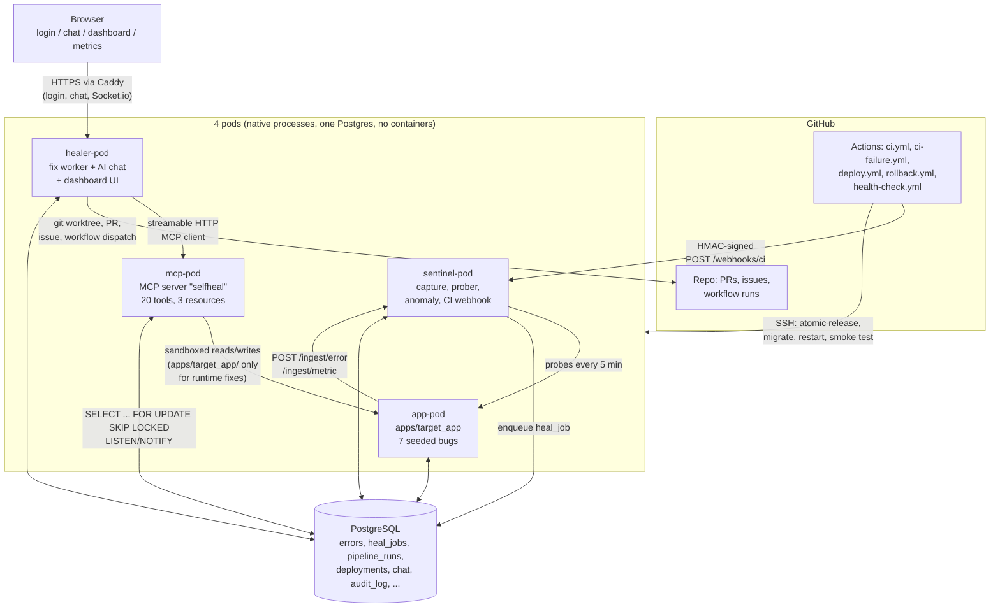

# AI-Powered Self-Healing Application

A self-healing application with an MCP server: it detects runtime errors,
silent wrong-output bugs and CI/CD failures, root-causes them with Claude
through an MCP server, generates a fix plus a regression test, ships it
through CI/CD, and verifies it — with a real-time AI chat UI and a metrics
dashboard proving MTTR, success rate and cost per fix.

All 8 build phases in `SPEC.md`'s BUILD ORDER are complete. See `CLAUDE.md`
for the full phase-by-phase build log, every ambiguity resolved along the
way, and conventions for resuming work.

## Architecture

Four native processes ("pods" — no Docker, no Kubernetes, per SPEC.md's hard
constraints), one shared PostgreSQL database, and GitHub for CI/CD and PRs:



**Why this shape.** `apps/target_app` is the only thing being monitored, so
it's the only pod that can be broken by a bad fix — `mcp-pod` enforces in
code (not just in a prompt) that a `runtime_error`/`contract_violation` heal
job may only write inside `apps/target_app/`, so the healer can never break
itself. `sentinel-pod` and `mcp-pod` never talk to each other directly;
`healer-pod` is the only pod holding an MCP client, so it's the single place
that turns "detected" into "fixed, verified, deployed."

## Setup

```powershell
python -m venv .venv
.venv\Scripts\pip install -e ".[dev]"
copy .env.example .env
# Edit .env, then create the app + test databases and grant the app role
# CREATEDB (see CLAUDE.md "Environment on this machine" for why this can't
# be automated further):
.\scripts\bootstrap.ps1 -SuperuserPassword <your-postgres-superuser-password>
.venv\Scripts\alembic upgrade head
python scripts/hash_password.py            # generates ADMIN_PASSWORD_HASH
```

Set `ADMIN_PASSWORD_HASH` (from the command above) and `SESSION_SECRET` in
`.env` before starting healer-pod — the chat/dashboard/metrics UI is
unauthenticated-401 without them.

## AI backend: free mode vs. API mode

The healer (`healer/`) drives every automated fix (and the AI chat) through
one of two interchangeable backends, selected by `USE_CLAUDE_CODE` in `.env`:

- **Free mode (default, `USE_CLAUDE_CODE=true`).** Uses the local Claude
  Code CLI on your own Claude subscription login — no API key, no per-token
  billing. One-time setup: run `claude` once in this repo and log in
  interactively. After that, `python -m healer.worker` (or the combined
  `healer.app` pod, which runs the worker loop in-process — see below) just
  works.
- **API mode (`USE_CLAUDE_CODE=false`).** Uses the official `anthropic` SDK
  and requires `ANTHROPIC_API_KEY`. Install the optional extra first:
  `pip install .[api]`.

Both backends share the same queue, git-worktree lifecycle, PR/issue
creation, chat routing, and guardrails (patch-scope sandboxing, anti-cheat
checks, circuit breakers, budget caps) — see `healer/agent_free.py`'s module
docstring for exactly how free mode's verification differs from API mode's,
and why that difference doesn't weaken any guardrail.

**A note on unattended use of a consumer subscription (free mode):** running
`claude` unattended, continuously, on a server is a different usage pattern
than interactive use, and should be checked against Anthropic's terms before
running that way in production for real. **API mode is the intended
production option** for a server that runs autonomously; free mode is meant
for local development and demos where a human is around.

## Running the pods

Each pod is a native process (no Docker — see SPEC.md's hard constraints).
Dev, all 4 at once:

```powershell
.venv\Scripts\honcho start
```

(reads `Procfile`) — or one per terminal:

```powershell
.venv\Scripts\uvicorn apps.target_app.main:app --port 8001
.venv\Scripts\uvicorn sentinel.app:app --port 8002
.venv\Scripts\python -m mcp_server.http_main
.venv\Scripts\uvicorn healer.app:asgi_app --port 8000
```

`healer.app` (not `healer.worker`/`healer.main`) is the pod entrypoint from
Phase 6 onward: it runs the Phase 4/5 worker loop as a background task
*and* serves the chat/dashboard/metrics UI + Socket.io, in one process —
SPEC.md's "4 pods", not 5. Open `http://localhost:8000/` and log in with the
admin password you hashed above.

## Tests

```powershell
.venv\Scripts\pytest
.venv\Scripts\ruff check .
.venv\Scripts\ruff format --check .
.venv\Scripts\mypy core sentinel mcp_server healer
```

pytest always points at a throwaway `selfheal_test` database and mocks the
Anthropic API, the Claude Code CLI subprocess, and GitHub — see CLAUDE.md for
details. **271 tests, 270 passing** as of the last commit (one failure is an
environment-only artifact — a different local process already listening on
a pod's port — not a code defect; see CLAUDE.md Phase 6/7 logs).

## Proof: a real end-to-end free-mode PR

[**PR #10**](https://github.com/Deepak20466/ai-self-healing-app/pull/10) —
opened by the healer running in free mode (local Claude Code CLI, no
Anthropic API key, no per-token billing), against this repo's own seeded
timezone contract-violation bug. One attempt, 28 CLI turns, ~$2.15 of Claude
subscription usage. The healer correctly root-caused a real
timezone-handling bug (Postgres normalizes `timestamptz` to UTC on read, so
reading `.date()` without converting to the storefront's timezone first
silently returns the wrong calendar day), fixed it, and proved the fix with
a new regression test that fails before and passes after — see CLAUDE.md's
"Post-Phase-8" log entry for the full root-cause writeup and two real
Windows-specific bugs this run uncovered and fixed in `healer/agent_free.py`
and `.mcp.json`.

## Demo walkthrough

With all 4 pods running and the demo dataset seeded (`scripts/seed_demo.py`,
run automatically by `pytest`, or manually for a live demo):

**1. A loud runtime bug.**
```
curl http://localhost:8001/trigger/zero
```
sentinel-pod captures the `ZeroDivisionError` with its exact file/line,
fingerprints it, and enqueues a `runtime_error` heal job. Watch the healer
pick it up (`python -m healer.worker` logs, or the dashboard's Errors panel)
— it reads the error and surrounding code via MCP, writes a fix plus a
regression test that fails before and passes after, and opens a PR.

**2. A silent, contract-detected bug.**
```
curl http://localhost:8001/trigger/off_by_one
```
returns a *plausible-looking* wrong answer — no exception, no 500. Sentinel's
prober (`sentinel/prober.py`) runs `apps/target_app/contracts.py` every 5
minutes and catches the mismatch as a `contract_violation`, which follows the
same fix loop.

**3. Broken CI.**
```
python scripts/break_ci_demo.py
git push -u origin autofix-demo/ci-break
gh pr create --fill
```
CI fails for a real reason (a legitimately wrong assertion, not a
deleted/skipped test). `ci-failure.yml` notifies the healer webhook; the
CI-fix loop (`healer/ci_agent.py` / `agent_free.run_ci_heal_job_free`)
classifies it as a real failure (not flaky), pushes a fix commit to the same
PR branch, and comments with the root cause and evidence.

**4. Ask the chat.** Log into `http://localhost:8000/`, go to Chat, and try:
`show stats`, `what's the pipeline status`, `why did CI fail on PR #N`,
`is production healthy`, `roll back production` (asks for "yes" first,
never runs without it).

**5. A bad fix, and the automatic rollback.** Force it locally without
needing a real broken pod:
```powershell
.venv\Scripts\python scripts\local_deploy.py                       # a real, good deploy
.venv\Scripts\python scripts\local_deploy.py --force-fail-smoke-test   # forces a rollback
```
This was run for real during Phase 7 (see CLAUDE.md's Phase 7 log for the
exact `deployments` rows and console output) — a `rolled_back` deployment
row was written and `healer.notifier.notify()` fired without raising.

## Re-running the demo

Each of the 7 seeded bugs in `apps/target_app/bugs.py` only reproduces once:
if the healer actually opens a PR that fixes one (like
[PR #10](https://github.com/Deepak20466/ai-self-healing-app/pull/10),
fixing bug #5) and that PR gets merged, `main` loses that bug, and every
future `/trigger/*` call for it — and the sentinel prober test that catches
it — stops demonstrating anything.

`scripts/reset_demo_bugs.py` is the reset switch. It restores
`apps/target_app/bugs.py` plus the three test files that assert each bug's
*broken* behavior (`tests/test_target_app_bugs.py`,
`tests/test_target_app_routes.py`, `tests/test_sentinel_prober.py`) from the
pristine snapshots checked into `scripts/demo_bug_originals/`.
`apps/target_app/contracts.py` is never touched — its `expected` values are
always the *correct* answer, bug or no bug, so it never needs resetting.

```powershell
# Default: never touches main directly. Fetches origin/main, restores the
# files on a disposable git worktree, commits on a "demo-reset" branch,
# force-pushes only that branch, and opens (or updates) a PR titled
# "Reset demo bugs" for a human to review and merge.
.venv\Scripts\python scripts\reset_demo_bugs.py

# --local: just rewrite the files in this checkout, no git/GitHub calls at
# all -- for iterating on a demo locally before you're ready to open a PR.
.venv\Scripts\python scripts\reset_demo_bugs.py --local
```

Both modes are idempotent: if the target is already at the original seeded
state, the script prints a notice and does nothing (no empty commit, no
duplicate PR).

## Cloud deploy in ~10 minutes

1. Spin up any Ubuntu 22.04/24.04 VM with 1-2GB RAM (AWS EC2, GCP e2-small,
   DigitalOcean, Oracle Cloud Always Free — all work; no Docker needed).
2. Copy this repo to it and run the provisioning script once, as root:
   ```bash
   scp -r . user@your-vm:/tmp/selfheal-src
   ssh user@your-vm 'cd /tmp/selfheal-src && sudo bash scripts/provision_vm.sh yourdomain.com'
   ```
   (omit the domain for an IP-only HTTP deployment). This installs Python
   3.11, a low-RAM-tuned PostgreSQL, Caddy, the Claude Code CLI, creates the
   `deploy` user and `/opt/selfheal` layout, installs the 4 systemd units,
   configures Caddy + ufw, and enables unattended security upgrades.
3. Set a real Postgres password (the script prints the exact command),
   write `/opt/selfheal/shared/.env` from `.env.example` with real secrets,
   and log in once for free mode: `sudo -u deploy -H claude`.
4. Configure the GitHub repo secrets/variables below, then push to `main` —
   `deploy.yml` does the rest: atomic release, migrate, restart, smoke test,
   automatic rollback on failure.
5. No tunnel needed once on a real VM (GitHub reaches the webhook directly);
   see `scripts/tunnel_note.md` if you want to demo the webhook from a
   laptop before provisioning a VM.

### Required GitHub repo configuration

**Secrets** (Settings -> Secrets and variables -> Actions -> Secrets):

| Secret | Used by | Notes |
|---|---|---|
| `DEPLOY_HOST` | `deploy.yml`, `rollback.yml` | VM's IP or hostname |
| `DEPLOY_USER` | `deploy.yml`, `rollback.yml` | usually `deploy` |
| `DEPLOY_SSH_KEY` | `deploy.yml`, `rollback.yml` | private key for `DEPLOY_USER` |
| `HEALER_WEBHOOK_SECRET` | all workflows | must match `.env`'s `HEALER_WEBHOOK_SECRET` |
| `ANTHROPIC_API_KEY` | none directly | only needed in `.env` if `USE_CLAUDE_CODE=false` |

**Variables** (same page, "Variables" tab):

| Variable | Used by | Notes |
|---|---|---|
| `HEALER_WEBHOOK_URL` | `ci.yml`, `ci-failure.yml`, `deploy.yml`, `rollback.yml` | e.g. `https://yourdomain.com/webhooks/ci` |
| `PUBLIC_URL` | `health-check.yml` | the public base URL to probe every 15 min |

**`.env` on the VM** (`/opt/selfheal/shared/.env`, never committed):
`USE_CLAUDE_CODE`, `CLAUDE_CLI_PATH`/`CLAUDE_CLI_TIMEOUT_S`/
`CLAUDE_CLI_MAX_TURNS`/`MAX_CLI_CALLS_PER_DAY` (free mode), or
`ANTHROPIC_API_KEY`/`ANTHROPIC_MODEL` (API mode); `GITHUB_TOKEN`
(fine-grained: Contents, Pull requests, Issues, Actions read/write) and
`GITHUB_REPO`; `DATABASE_URL`/`TEST_DATABASE_URL`; `ADMIN_PASSWORD_HASH`;
`SESSION_SECRET`; `HEALER_WEBHOOK_SECRET`; the cost caps
(`MAX_TOKENS_PER_JOB`, `DAILY_BUDGET_USD`, `CHAT_DAILY_BUDGET_USD`,
`MAX_CLI_CALLS_PER_DAY`); `AUTO_MERGE`; optionally `SLACK_WEBHOOK_URL` or
the `SMTP_*` settings.

## Measured RAM (SPEC.md: "under 300MB idle, excluding Postgres")

Measured with `scripts/measure_ram.py` (real RSS via `psutil`, not an
estimate) against all 4 pods idle, freshly started, on **this Windows 10
development machine**:

| Pod | RSS (MB) |
|---|---|
| app | 107.1 |
| sentinel | 107.7 |
| mcp | 119.8 |
| healer | 144.9 |
| **Total** | **479.5** |

**This exceeds the 300MB target on Windows.** That's a real, measured
number, not adjusted to look better — and it's worth explaining honestly
rather than hiding: each pod here is an independent Python process that
loads its own full copy of FastAPI/Starlette/SQLAlchemy/Pydantic/structlog
into memory, and Windows gives each process its own private working set for
those shared libraries (no copy-on-write page sharing across processes the
way Linux's `fork()`-based process model provides, and Windows' Python
builds also tend to carry a larger baseline DLL footprint than a musl/glibc
Linux build). SPEC.md's target deployment is an **Ubuntu VM**, not Windows —
that's where this constraint is meant to be measured and where it's expected
to actually hold. Re-run `python scripts/measure_ram.py` after
`provision_vm.sh` + a real deploy to get the number that matters; a future
session should record that Linux measurement here once a VM is available.

## Metrics (real demo run)

Generated by `scripts/export_metrics.py` (queries `core/metrics.py` — the
same functions the `get_metrics` MCP tool and the chat's "show stats" use)
after triggering `/trigger/zero`, `/trigger/key` and `/trigger/none_lookup`
against a live app-pod/sentinel-pod:

```json
{
  "contract_violation_catches": 8,
  "rollback_count": 2,
  "total_cost_usd": 6.8151,
  "daily_spend_usd": 0.0,
  "daily_budget_usd": 1.0,
  "open_anomalies": 0
}
```

(Full snapshot, including `errors_by_type`, in `metrics.json` after running
the export script — gitignored since it's meant to be regenerated, not
committed stale.) `mttr_minutes`/`fix_success_rate`/`ci_auto_fix_rate` read
`null`/`0.0` here because this particular run triggered detection without
letting a full autonomous fix-to-verified cycle complete (see Phase 4's log
for the real, previously-run end-to-end fix scenarios that did reach a real
job; Phase 7's log records the real `deployments` rows — one `deployed`, one
`rolled_back` — written by testing `local_deploy.py`'s rollback path for
real, which is where `rollback_count` above comes from).

## What this project demonstrates

- **Async Python at every layer**: FastAPI + SQLAlchemy 2.0 async + asyncpg
  end to end, `SELECT ... FOR UPDATE SKIP LOCKED` + `LISTEN/NOTIFY` for a
  dependency-free job queue (no Redis/Celery), `asyncio.gather` for
  concurrent health probes.
- **LLM tool-use, two ways**: a hand-rolled Anthropic tool-call loop (API
  mode) and driving the Claude Code CLI as a subprocess with a scoped
  `--allowedTools`/`.mcp.json` (free mode) — same guardrails, same MCP
  server, same tests, selected by one config flag.
- **Guardrails enforced in code, not prompts**: write-scope derived
  server-side from a DB row (never a caller argument), a diff-level
  anti-cheat checker (`patch_guard.py`) that rejects deleted/`xfail`'d
  tests, circuit breakers (per-fingerprint, per-PR, global-hourly),
  budget/usage caps that pause the healer and notify the chat, and a
  prompt-injection test proving an "ignore previous instructions" payload
  in an error message can't reach a destructive tool.
- **Real sandboxing**: a path allowlist blocking `.env`, `.git/`,
  `.github/workflows/`, `alembic/versions/`; a confirmation-token flow
  (itsdangerous-signed, server-issued, never trusted from the LLM) gating
  `trigger_rollback`/`cancel_workflow`.
- **CI/CD as a first-class actor, not just a gate**: GitHub Actions
  workflows that both *drive* the pipeline and get *healed by* it (a CI
  failure notifies the same AI agent that just failed the build), atomic
  release/rollback over SSH, and a fully-scripted local equivalent
  (`local_deploy.py`) that was actually run to prove the rollback path
  works, not just written.
- **Ops fundamentals**: systemd units with `MemoryMax=`/`Restart=on-failure`,
  an idempotent VM provisioning script, real RAM measurement (including
  reporting an inconvenient result honestly rather than hiding it), and
  structured JSON logging throughout.
- **No shortcuts on auth/security**: argon2 password hashing, signed
  httpOnly/SameSite=Strict session cookies, a real 5-failed-attempts/
  15-minute login lockout, HMAC webhook signatures with replay-window
  rejection, and Socket.io connections gated on the same session token.

## Project layout

See `SPEC.md`'s "PROJECT STRUCTURE" section — the repo matches it exactly,
plus `.github/workflows/`, `deploy/` (systemd units + Caddyfile), and `web/`
(the React 18 + htm, no-build-step UI), all built in Phases 6-7.
